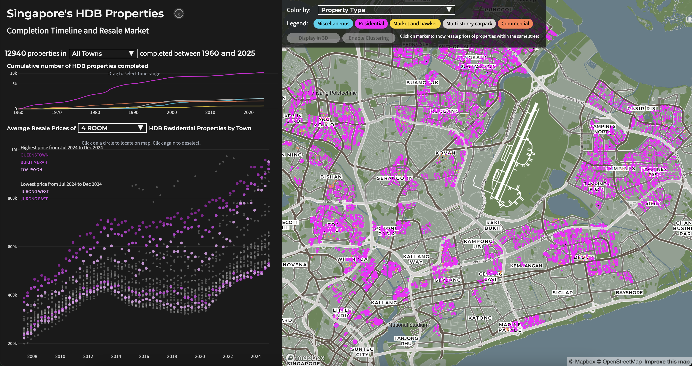

# Singapore's Housing Development Board (HDB) Properties: Completion Timeline and Resale Market

## Overview

This interactive visualization tool provides an intuitive way to explore Singapore's HDB (Housing & Development Board) property market. By combining historical resale transaction data with geographical information, users can gain valuable insights into property trends across different neighborhoods and time periods.

The application features a dynamic timeline interface that allows users to:
- Track property price changes over time
- Compare prices across different towns and streets
- Filter properties by completion year, flat type, and location
- Visualize property attributes such as price distributions through color-coded maps

## Architecture

Raw data was pulled from the multiple API endpoints from Singapore's open data portal: data.gov.sg. The Flask backend performs data processing and transformation and sends the ouput to the frontend which is built with React and Mapbox.

Key components:
- **Data Collection**: Automated data extraction from data.gov.sg APIs
- **Data Processing**: Flask backend for data aggregation and transformation
- **Data Visualization**: React frontend with Mapbox integration
- **Deployment**: Vercel platform with automated cron jobs

## Backend

The Flask backend serves as the data processing layer, handling several key responsibilities:

1. **Data Integration**
   - Fetches data from multiple data.gov.sg endpoints
   - Processes property information, resale transactions, and geographical boundaries
   - Geocoding properties using OneMap API

2. **Data Processing**
   - Aggregates resale prices by location and time period
   - Generates optimized data structures for frontend consumption

3. **API Endpoints**
   - RESTful endpoints for data retrieval

## Frontend

The frontend is built with React and Mapbox, creating an intuitive interface for exploring HDB property data. 

The map interface serves as the central component of the application. Using Mapbox GL JS, I created a custom map visualization that displays all HDB properties across Singapore. I styled the basemap within Mapbox Studio. The map features a circle marker layer with properties color-coded based on various attributes such as price range, age and property types. The map's pitch (tilt) can be adjusted, and the marker layer can be swapped for a clustered property count layer. 

The chart view offers an alternative perspective on price trends across and within towns. Built with D3.js, it dynamically highlights corresponding map locations when users interact with data points. Clicking a map marker highlights the related dots on the chart. Custom event handlers in React ensure seamless synchronization between the chart and map views.

The filtering system allows users to narrow down their search based on multiple criteria. The filters include dropdown menus for property types, completion years, and location-based selections.

The legend system provides context for the color-coded visualizations. I created a custom legend component that updates dynamically based on the current view and selected filters. Each legend element is interactive and allow users to toggle specific data categories on and off.

## Insights

The visualization reveals several notable trends in Singapore’s HDB resale market:

**Price Evolution Over Time**: Resale prices have generally increased, with distinct periods of growth and stabilization.Resale prices experienced a significant uptick since 2020.

**Emergence of Million-Dollar HDB Flats**: The data highlights HDB resale flats transacting at or above S$1 million. Mature estates such as Toa Payoh, Kallang/Whampoa and Bukit Merah were notable for their significant number of high-value transactions.

**Neighborhood Price Variations**: Prime locations such as the Central and Queenstown regions exhibit consistently higher resale values, whereas areas further from the city center, like Woodlands and Jurong, remain more affordable.

**Price Variations Within Towns**: Towns such as Central Area, Queenstown and Toa Payoh exhibit significant internal price disparities, possibly due to the mix of older and newer flats within.

**Impact of Completion Year**: Flats completed in the last two decades tend to fetch higher resale prices, but some older estates such as Queenstown retain strong value as it is a prime location with proximity to amenities and the city center.
